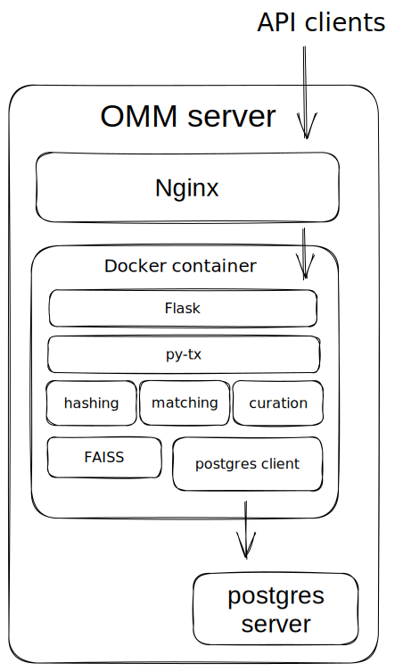
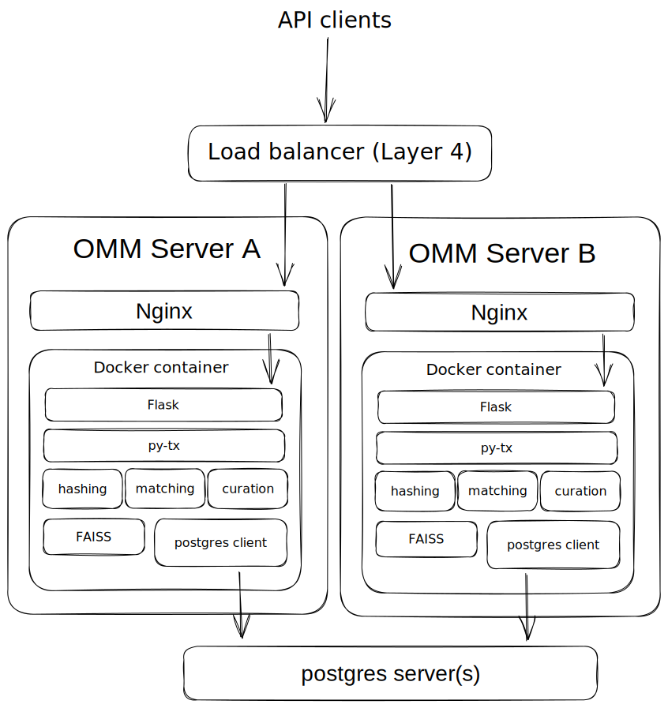
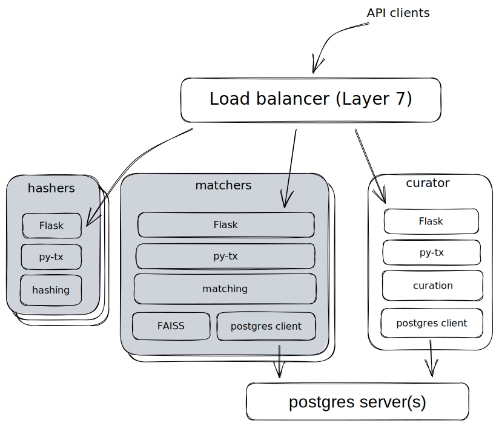
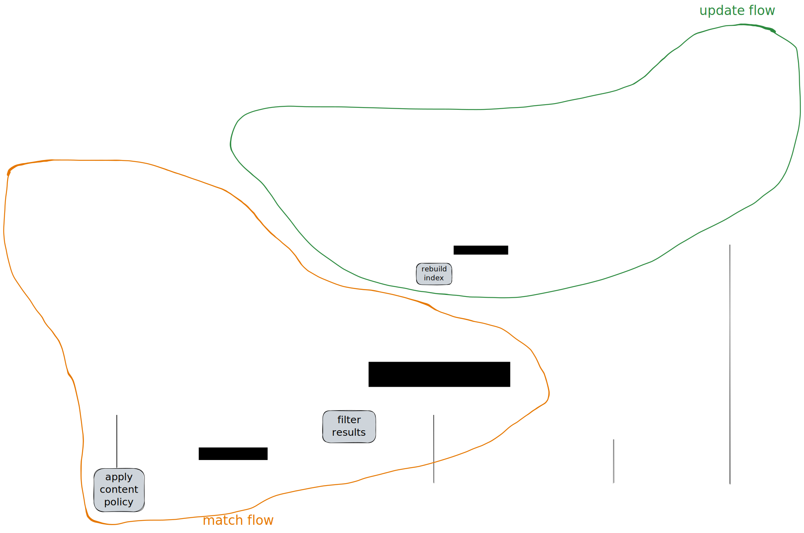
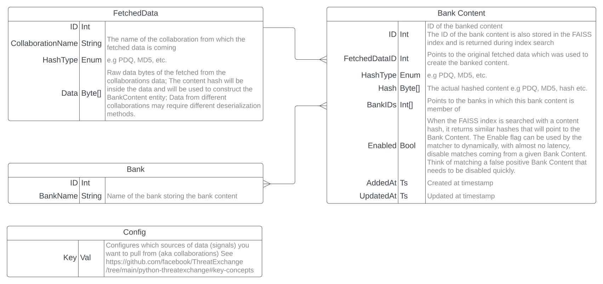

# Hasher Matcher Actioner (HMA)

*Note: HMA has just completed a rewrite! It is now an entirely new architecture. You can [read our motivations below](#hma-10-aws-hma---hma-20-open-media-match). If you need the HMA 1.0 code (Terraform, AWS, node), it lives forever with a copy of its wiki at [HMA_1.0_archive](https://github.com/facebook/ThreatExchange/tree/HMA_1.0_archive/hasher-matcher-actioner)*

# Project Introduction


# Architecture

## The Stack

### Python Libraries

#### `python-threatexchange`

The core functionality is a Python package, evolved from the existing python-threatexchange package (`py-tx`). This package contains a Python library which implements all of the core functionality:
* Computation of image hashes using PDQ
* Compute hashes/signatures using other algorithms (e.g. MD5 for video)
* Management and curation of a local database of hashed content
* Exchange of hash lists (with third parties (NCMEC, GIFCT, StopNCII, ThreatExchange, others)
* Similarity search of candidate content hashes to known content

This library could be consumed purely as a component in a hypothetical in-house media matching system, but what is more likely is that it will be deployed as a service using the included REST API, built upon Flask, and managed via the included CLI.

#### Open Media Match Library

If you wish to deploy HMA manually (without the container) or roll your own container using an alternative container technology to Docker, HMA can be used as a library, which may require some additional customization to work for your environment.

#### API and CLI

The API and the CLI simply expose the functionality of the library as an HTTP REST service and as a command line tool, respectively. These are built into the Python package: Install the Open Media Match package and you get the library, the API, and the CLI all in one.

#### Docker Container

For convenience and simplicity, we also distribute the API service as a Docker container image. This allows rapid, low-dependency deployment into development and production environments based on a recommended and supported Python stack.

#### Service Dependencies

The only dependency is the database, for which we use Postgres.

Depending on your deployment scenario (read on), you will most likely also need a reverse proxy, Layer 7  router, or application load balancer (depending on your preferred terminology) to handle TLS termination, authentication and authorization, request routing, and maybe even caching. For example:
* Nginx
* Træfik
* Kubernetes ingress controller
* Apache HTTPD
* Amazon Application Load Balancer
* Azure Application Gateway


If you're operating at the scale where this becomes necessary, you will more than likely already have your own preferred solution here.

## Deployment scenarios and scaling strategies

### Single instance



It's entirely possible to run everything on one machine. This has the advantage of being the easiest to set up and configure and is appropriate for:
* Evaluation, local development and testing
* Production environments with low traffic levels, low time-sensitivity, or otherwise relaxed availability constraints (i.e. you can tolerate the service being down for a short time)
* Keeping costs and complexity to a minimum

A single-instance Postgres can be run as a sidecar container next to the API server container, in the host OS, or on another machine.

### Redundant instances



A typical production environment would require some degree of redundancy such that the loss of one server doesn't cause a service outage. In this scenario, you would run two identically sized Docker containers, on two separate Docker or Kubernetes hosts, with the Postgres database service in a third location with a redundancy strategy of its own.

Database redundancy is hard, and dependent on uptime constraints, budget, and engineering bandwidth available to support such a setup. Hosted managed Postgres services are also available on the market, e.g. Amazon RDS and Azure Database for PostgreSQL.

### Vertical scale-up

Building on the above, as traffic grows, the containers can simply be resized to accommodate the additional demand, by allocating them additional CPU cores and memory.

### Horizontal scale-out - split roles



At the higher end of the scaling curve, it becomes advantageous to run the API in a split-role pattern. This simply means having disjoint sets of instances in role groups where each role group is dedicated to one particular functional area of HMA.

These roles are:

#### Hashers

The hashers simply take content (images) in, and spit out PDQ hashes. This makes them simple, stateless, and dependency-free (no database connection is required!). They are also the most computationally demanding, due to needing to decompress, decode, and digest image files.

#### Matchers

Matchers connect to the database as read-only clients, monitor for new additions, and periodically rebuild their (in-memory) FAISS indices.

Their inputs are the hashes of candidate images (most likely having just had their hash computed by the adjacent hasher nodes), and their outputs are the hits in the similarity index fused with any relevant metadata about the match (severity, violation type, source of hash etc), as pulled from the database.

#### Curators

The curators handle all functions related to editing the contents of the database such as:
* Importing hash lists from the ThreatExchange
* Adding newly-identified violating content
* Editing the metadata of known content
* Removing, disabling or tombstoning content to be excluded from matching

A split-role deployment pattern allows each role to be scaled independently. We expect that sites will differ in how they scale depending on their traffic patterns, database sizes, update frequency, throughput, uptime and latency requirements.

Routing of incoming API requests to the correct role group backend is made as simple as possible by the design of the API, which follows least-surprise principles and is compatible with simple path-based routing.

## Request/Response flows

Two concurrent API call flows are illustrated here. From the left, we have the hashing/matching flow that would typically be called at high frequency in the content upload path for real-time or near-real-time scanning of uploaded content. From the right, we have administrative actions from the site operators who are updating the database of known violating content.



## Backend

### Database Schema



### Indexing: FAISS

[FAISS](https://github.com/facebookresearch/faiss) is an open source library that provides efficient solutions for similarity search and clustering of dense vectors. This is particularly well-suited to media similarity search. We start with a simple table which maps content IDs to their PDQ hash:

| Bank Content ID: `int64` | Hash: `vec[int8]`    |
| ------------------------ | -------------------- |
| 1001                     | `[32, 123, 43, ...]` |
| 1002                     | `[312, 33, 12, ...]` |
| ...                      | `...`                |

Note that in this example we're using PDQ hashes, but any hash that decomposes to a vector of numbers will work just as well.

Given the above table, the FAISS index can be built which provides high performance nearest-neighbor lookups from the hash to the matching content IDs. During matching, the FAISS index is queried with a vector which, for example, could be the PDQ hash of a photo that we want to check for similarity to any of our known content. The results of the query are the vectors (hashes) in the index which are within a specified threshold distance to the queried one vector, as well as their ID. There are different functions for distance evaluation that can be used, such as euclidean and cosine.

In HMA, the hash lists are populated by the Curator, and the FAISS indices are periodically rebuilt, in-memory, by the Matchers.

At match time, the index returns the matching vectors and their associated content IDs. These IDs are then used to pull the full set of content metadata from the database which will inform the client system as to what exactly the candidate photo matched against.

It should also be possible to split the index from the matcher, and substitute FAISS with other Vector Database technologies if you are looking to use HMA as a library or are customizing it further. Some example databases that will likely work:
* Pinecone
* Milvus
* Pgvector
* Vertex AI

### Data exchange: python-threatexchange

Under the hood, HMA builds on the core interfaces of python-ThreatExchange. The key ones being:
* **SignalExchangeAPI**: Frameworks for connecting to external sources of trust & safety information and translating them to a common compatibility layer
* **SignalType**: A technique using serialized information (signals, hashes, embeddings, etc) to flag or match content
* **ContentType**: How to map which signals are relevant to content on your platform

HMA will allow you to add more instances of these interfaces (which allows customizing its behavior to your platform, say for example by creating custom ContentType to cover your complex objects like posts, comments, or live streams), but it will fall back to a naive implementation that might not scale. You may need to customize much more of its internals to get the same functional guarantees provided by PDQ and MD5. 

## API

As HMA is not planning to provide a production UI, the API is the key point of integration. We hope that users are able to treat it as a “black box” with the API defining the inputs and outputs.

### Fetching / Exchanges

Which exchanges (SignalExchangeAPI) are supported by the instance of HMA are configured on deployment. During runtime, configs for fetching from new sources can be created and edited.


* Create Exchange Configuration
    * Inputs:
        * Configuration name in `CAPS_AND_UNDERSCORE` (must not be the same as an existing bank name)
        * Exchange type
        * Exchange-specific arguments (depends on SignalExchangeAPI)
* List all configs
    * Output:
        * List of all config names
* Get Exchange Configuration
    * Inputs:
        * Configuration name
    * Output: JSON serialization of configuration
        * Includes exchange type
* Get Exchange Fetch Status
    * Inputs
        * Configuration name
    * Outputs
        * Time of last fetch in unix time
        * Time of checkpoint in unix time
        * Whether the last run resulted in an error
* Get Exchange-specific Metadata
    * Input:
        * Configuration name
        * Exchange-specific ID
    * Output
        * JSON serialization of metadata specific to Exchange
* Edit Runtime Configuration properties
    * Inputs:
        * Configuration name
        * Optional Bool enable/disable fetching
        * Optional Bool enable SEEN status
        * Optional Bool enable True Positive / False Positive reporting
* Delete Exchange Configuration 
    * Inputs
        * Configuration name
        * Optional - whether to also delete the bank (defaults to true)
* [TBD] Submit content directly to exchange
    * Inputs
        * SignalType
        * `string` Signal value
        * Status (`positive_class`, `negative_class`, `investigation_seed`)
        * List of tags

### Banking / Hash Lists

What algorithms are used, and what similarity settings to use (e.g. PDQ distance) are configured on deployment. 

* Create Bank / Hash List
    * Inputs
        * Bank/List name in `CAPS_AND_UNDERSCORE` (must not be the same as an existing bank name)
* Edit Runtime Configuration properties
    * Inputs
        * Bank/List name
        * Optional `bool` enable/disable matching
        * Optional `list<string>` bank labels
    * Get Bank/List Configuration properties
        * Inputs
            * Bank/List name
        * Outputs:
            * JSON serialization of bank properties
                * Includes if it is connected to an Exchange
* Get Bank/List Metadata 
    * Inputs
        * Bank/List name
    * Outputs
        * Number of items in the bank/list
        * Number of signals in the bank broken down by type
* Get Bank/List Contents (ordered by modification time)
    * Inputs
        * Bank/List name
        * Page size
        * Optional pagination token
    * Outputs
        * A list of bank contents. A bank item includes
            * Bank Content ID
            * List of signals. A signal includes
                * Signal type (string)
                * Signal value (string)
        * A pagination token for getting the next page of data
* Add content to Bank/hash list
    * Inputs
        * Bank Name
        * One of the following:
            * Bank content ID 
            * Signal type, value
            * Content type, bytes
        * Optional platform-specific content ID
        * Optional `list<string>` of review labels
    * Output:
        * Bank content ID
* Remove/Disable content from bank/hash list (exchange-backed banks will retain a disabled record)
    * Inputs
        * Bank content ID
* Get Bank Content
    * Inputs
        * Bank content ID
    * Outputs
        * Bank Name
        * Bank labels
        * List of Exchange-specific IDs
* Delete Bank (will error if attached to an Exchange - must be deleted at the exchange level)
    * Inputs
        * Bank name

### Hashing

What ContentTypes and SignalTypes are supported are configured on deployment. 

* Hash Content
    * Input
        * Content type (`string`)
        * `byte[]`
        * Optional `list<string>` list of SignalTypes to use
        * Optional file extension hint (needed sometimes for photos/videos for underlying libraries)
    * Output
        * List of signals. Signals include
            * Signal type
            * Signal value (`string`)
* [TBD] Hash+Match (may be slow / require long polling)
    * Inputs
        * Content type (`string`)
        * `byte[]`
        * Optional `list<string>` of SignalTypes to use
        * Optional `list<string>` of Bank/List names to restrict search to
        * Optional file extension hint (needed sometimes for photos/videos for underlying libraries)
    * Outputs
        * List of Bank content IDs

### Matching

What SignalTypes, and what similarity settings to use (e.g. PDQ distance) are configured on deployment.

Additional SignalTypes can be made available by setting the `SIGNAL_TYPES` variable in the config.
Here is an example with CLIP signal type, after installing it with `pip install tx-extension-clip`:

```
from threatexchange.signal_type.pdq.signal import PdqSignal
from threatexchange.signal_type.md5 import VideoMD5Signal
from tx_extension_clip.signal import CLIPSignal

SIGNAL_TYPES = [PdqSignal, VideoMD5Signal, CLIPSignal]
```


* Lookup
    * Input
        * Signal type
        * Signal value (`string`)
        * Optional `list<string>` of Bank/List names to restrict search to
    * Output
        * List of Bank content ID
* Index Status
    * Input
        * SignalType (`string`)
    * Output
        * Time of last index build

### Recording Review Results

* Record review led to discovery of harm - will communicate with exchanges if the exchange is configured to do so
    * Input
        * `list<string>` of Bank Content IDs
        * Optional `list<string>` of labels - if the label doesn’t match a bank labels it will change or prevent which information is recorded back to the exchange
*  Record review did not lead to the discovery of harm
    * Input
        * `list<string>` of Bank Content IDs
        * Optional `list<string>` of labels - if the label doesn’t match a bank labels it will change or prevent which information is recorded back to the exchange

# HMA 1.0 (AWS HMA) -> HMA 2.0 (Open Media Match):
In March of 2024, [we archived](https://github.com/facebook/ThreatExchange/tree/HMA_1.0_archive/hasher-matcher-actioner) the original version of HMA, and replaced it with a full rewrite, which is what you'll find here. Below you can find our reasoning for doing so.


## Predecessor project: Hasher-Matcher-Actioner 1.0

HMA 1.0 was an earlier effort to build an offering based on open source components that could be picked up and deployed in a turn-key fashion for the purposes of hashing and matching content against databases of known harmful material at scale. However, we got feedback from industry that the lack of flexibility and hard dependencies on Amazon Web Services for critical components prevented several potential users from being able to deploy it. Additionally, the high number of dependencies needed to provide the robust functionality have become a maintenance burden over time.

With Open Media Match (HMA 2.0), we propose to build a new, entirely open source offering of composable components. We will drop the UI element and focus entirely on the backend API, we will eschew as many dependencies as possible, including those to specific cloud environments like AWS in favor of a containerized solution, and aim to be as infrastructure-agnostic as possible.

## Compare and contrast to HMA

| HMA 1.0 (AWS Deployed) | HMA 2.0 (Docker image only) |
| -------------------------------------- | ---------------- |
| Heavy AWS dependencies: VPC, DynamoDB, Lambda, API Gateway, ... | OSS dependencies only |
| Opinionated: only supported by included Terraform scripts | Runs in any Docker based infra |
| Service capabilities provided by AWS Lambda | Service capabilities provided by composable and repackageable components |
| AWS only, needs its own S3 buckets and DynamoDB tables | Integrates anywhere Docker can be used, or under self-managed Python/Flask |
| Includes a GUI and API | API only |
| Scales automatically | Doesn't auto-scale but can be auto-scaled |


## Motivations

### Simpler setup and Time-to-Evaluation

While HMA 1.0 in theory was only a single terraform command to stand up an instance, in practice, getting the AWS infrastructure in place, and potentially jumping through many hoops to make it play nicely with your existing AWS infrastructure prevented evaluating the functionality to see if it was worth spending the time to complete an integration. We have found that many users want a way to evaluate the capabilities as fast as possible, which the Terraform and AWS dependencies are at odds with.

With HMA 2.0, we will specifically focus on this evaluation step, potentially allowing users to evaluate on a single machine - even a developer laptop.

### Reduce barriers to adoption

The ThreatExchange team originally chose the AWS dependency as part of scaling targets (4,000 QPS hash lookups), for an initial industry partner that could use AWS. 

Since release, while some industry and NGO partners have been able to deploy and use AWS HMA, other industry partners have given feedback that the hard AWS dependency is not reconcilable with their business and technical constraints on what third-party software they can run, and where they can run it.

With HMA 2.0, we are limiting the number of dependencies and removing reliance on cloud-specific infrastructure.

### Facilitate external integrations

Hasher-Matcher-Actioner includes a GUI tool for interacting with the matching service and managing the hash database, but it's a standalone offering tightly coupled to HMA, and doesn't facilitate integration with either a client's internally-built tools or with an open source harmful-content management tool.

### Improve the Python-ThreatExchange Interfaces

Python-ThreatExchange was envisioned as a compatibility layer for trust and safety teams, academics, and open source contributors to make sharing improvements easier. However, to deploy and use these systems are either too tightly bound with HMA (AWS) or the CLI, and so make selective and compositional use of the library difficult. The design of HMA 2.0 will aim to standardize the core HMA steps (Fetching, Storing, Indexing, Hashing, Matching, Recording review results) in a way that makes them easier to partially adopt.

See [#1247](https://github.com/facebook/ThreatExchange/issues/1247) for more detail. 

## Goals and non-goals

### Goals

#### Deployment & Use

* No dependencies on any specific cloud provider (it should be possible to deploy in AWS, Google Cloud, on-prem, etc)
* Should have a single-box (including developer laptop) deployment for testing and development.
* The primary means of interacting should be API-based, to focus on integration to existing partner platform stacks
* Support an unnamed proposed human review tool being pitched by an industry partner.
* Have a minimum of third-party dependencies to simplify long-term maintenance.

#### Support the “Evaluation Step” for Platforms Onboarding to Signal Sharing Programs

Should contain enough functionality to do the “evaluation step” for joining new cross-industry programs. This means:
* Single instance/machine deployment
* With smallest possible configuration, can independently contact the external API, download all data, and prepare indices.
* Clear way to tell if an instance has completely downloaded and prepared all data for matching.
* Handle modest test traffic from the single instance 
    * On the scale of all human reviews: 1-10 qps
    * On the scale to reliably detect 1-per-million harms within 1 week of sampled production traffic (~4.6M samples over 1 week => 0.13 qps)
* Produce a logfile or simple-to-pass-to-manual-review output at the end of that week

#### Key Features

* Supports all core interfaces of python-ThreatExchange: SignalType, ContentType, SignalExchangeAPI
* End-to-end lifecycle support for cross-industry programs
* Full implementation for a limited number of SignalTypes and ContentTypes
  * Image + PDQ
  * Video + MD5
  * Naive Hashing + Naive SignalType index build & match to support testing new SignalTypes, though potentially with a very inefficient implementation.
* Quick disable/enable for matching on single Signals and hash lists
* Simple API for forming hash lists and recording review results

#### Functional Requirements

* Single box instance
    * Be able to fetch, store, index at least 10M PDQ hashes
        * Use less than 8GB memory at peak
        * Use less than 100GB disk
        * No GPU requirement
    * On to-be-defined target hardware:
        * Handle >1 qps image lookups (hashing + matching)
        * Handle >1 qps video hash lookups (matching)
    * Multi-instance deployment, with horizontal scaling:
        * 1000 qps image hash + match should be possible
        * 100M PDQ hash index should be possible
        * <1d latency on fetching & indexing signals from external sources
        * <10 minute latency on being able to match newly-added hashes
        * <10 minute latency on being able to stop matching disabled hashes
        * <10¢ / 1000 images scanned (<$100 / 1M images) - no more than 10x more expensive than AWS HMA

### Stretch Goals

#### Live Content Clustering

An HMA 2.0 instance that is being used to scan live traffic on a platform has all of the data needed to automatically generate clusters of content, and allow measurement of viral content. Storage costs for such as system scale with the number of hours or days supported. This could quickly unlock valuable capabilities for a platform:
* Grouping human review by similar content
* Automated flagging of high-virality content for review
* Review prioritization based on instances on platform
* Network discovery tooling
* Deduping jobs in a review queue

#### Retroaction (aka Live Traffic Replay)

Similar to Live Content Clustering, it’s common that content might already have been uploaded to a platform before it might be manually flagged and reviewed. Your platform may want to be able to match content *after* it has already been uploaded. HMA 2.0 has all the interfaces needed to implement this natively. 

### Non-goals

#### User Interface

Adding in a user interface would require taking on significant additional dependencies, and may not be used by all users. For now, we plan on only providing a UI in the AWS-deployed version of Hasher-Matcher-Actioner. This version uses an API (and some CLI helpers) as the main interface.

#### Actioning Interface / Combining Classification Signals

HMA (AWS) provided a way to rewrite “Action Rules” that trigger after content has been classified by HMA during a match. This allows combining multiple classification signals or triggering multi-step verification. However, we are holding off on any interface for HMA 2.0 for now. 

#### Complex Video Lookup (e.g. vPDQ)

There are types of content lookups that require bespoke or customized indexing solutions. vPDQ, for example, generates variable-length hashes that need to be stored in multiple formats to do a complete lookup. We are choosing to punt on this implementation, though the “Naive” SignalType implementation would allow using vPDQ at very low scales.

#### High Scale

If you are at the scale where you need greater than 1000qps of lookups, or high scale video matching, the complexity to support it starts to require large dedicated teams to build and support that complexity. If you’ve made it here, your platform is very likely a successful one and it makes sense to start building bespoke solutions tailored to your infrastructure and content. You may also be near the threshold where you are experimenting with your own detection systems and proprietary embeddings, which may need different solutions than the ones presented in HMA 2.0.

# Contributors

* [David Callies](https://github.com/Dcallies)
* [Sam Freeman](https://github.com/Sam-Freeman)
* [Nikolay Gospodinov](https://github.com/NikolayOG)
* [Doug Neal](https://github.com/dougneal)
* And many more!
