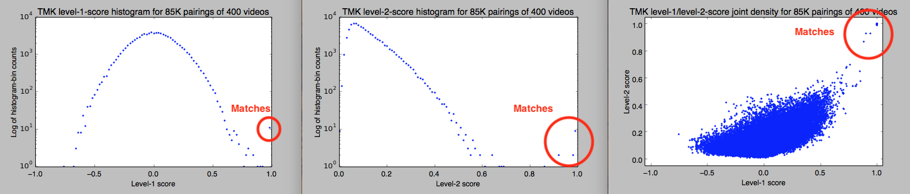

# Summary

TMK (for _Temporal Match Kernel_) is a video-similarity-detection algorithm
produced in conjunction with Facebook AI Research ('FAIR').

- Full details are located in the [hashing.pdf](https://github.com/facebook/ThreatExchange/blob/main/hashing/hashing.pdf) document.

- See https://newsroom.fb.com/news/2019/08/open-source-photo-video-matching for context.

- Researchers in video copy-detection algorithms may also be interested in
  https://github.com/facebookresearch/videoalignment for a research version of
  TMK, with different parameter-weighting than presented here.

# Status

- For cross-company sharing, for exports, one needs to compute hashes for a
  relatively small list of banked videos, then publish those data (over
  ThreatExchange, for example) -- this is a small-scale endeavor. For imports,
  one needs to hash _all_ to-be-checked videos and compare them against a
  hash-list -- this is a large-scale endeavor. At present (2019-01-18) this code
  is single-machine-only: nothing is connected up to databases or RPC yet.

- Integration with [FAISS](https://github.com/facebookresearch/faiss) has been
  successfully prototyped -- we will post information about this soon.

# Goals

- Make sure you can hash the exact same sample videos (in this repo -- see below) and get the same hashes (within roundoff error)
- Let us know about file-format issues: at FB the upload-checker runs after videos in various formats have been transcoded to MP4, so we have no data on TMK with AVI, MOV, etc. Also note that the floating-point numbers within the `.tmk` files are all stored **little-endian**.
- See if you can find matching content on your site, using initial match-threshold numbers.
- Please feel free to contact us with feedback on the code, this documentation, or any other suggestions for additional rollout of this algorithm. And/or simply put up a pull request if you prefer.
- In particular, we already know that several companies preferred a Java port of PDQ; we suspect the same will hold true for TMK.

# TMK scoring

- For each video file, the hasher channels the output of `ffmpeg` (which you need to separately install) to produce a `.tmk` file.
- You can think of the feature-vectors file as opaque binary files if you like. However please do see `./tmk/tools/tmkdump.py` which shows how to display the binary `.tmk` files in human-readable format.
- The **.tmk** files contain:
  - **Metadata** about how the hash was computed (so we can avoid mixing hashes produced by different, incompatible software).
  - A **pure-average feature**. Think of a 'frame feature' as a floating-point hash of a single video frame. Then the pure-average feature is the slotwise average over all the frames of the video.
  - **Cosine and sine features**. These are nothing more than **weighted** average of frame features, with various periods and various fourier-coefficient weights
- We can compute a **level-1 score** for a pair of videos using cosine similarity of their pure-average features. This is quick to compute.
- If the level-1 score is less than a threshold, the videos don't match. If it's above, then we compute a **level-2 score** using all the cosine/sine features. (Details are in `tmkfv.cpp`.) If this level-2 score is over a second threshold, then the videos do match. (If you want to compute the full TMK level-2 pair-score between an arbitrary pair of videos, then set the level-1 threshold to -1.)
- Possible values for level-1 score range from -1 to 1 (1 being perfect match); possible values for level-2 score range from 0 to 1 (1 being perfect match).
- Values of those thresholds are suggested at 0.7 for each.

# Prerequisites

We need to have ffmpeg (https://www.ffmpeg.org/) downloaded and working.

The sample hashes were generated with ffmpeg version 4.1 so if you have any issues with `make regtest` check your ffmpeg version.

# Getting started

First let's compile the code and compute hashes of some sample videos, and make
sure we're all getting compatible results. Namely, I've got some sample videos
in this repository which I've hashed on my platform. If you hash those exact
same video files on your platform, you should get nearly-identical hashes.

Note: these few sample videos I took myself on my phone; there are no data-privacy issues.

## Compile the code

There are no external source-code dependencies; you just need a C++14 compiler. Also you'll need the `ffmpeg` executable -- for example, located in `/usr/local/bin/ffmpeg`.

```
$ cd cpp
$ make
```

Notes:

- We have a simple `Makefile` in order to reduce the number of dependencies, so people can get up and running quicker.
- FB-internally we use `buck`; please let us know if you want Buck `TARGETS` files.
- This simple Makefile build does not execute any `*test*.cpp` files, which `buck test` would. Hence the importance of computing hashes for sample videos (see next step).

## Windows users

Some basic modifications have been made to enable support for Windows. To compile, you will also need to install `make`, e.g., via [choco](https://community.chocolatey.org/packages/make) and [MinGW](https://osdn.net/projects/mingw/).

- MinGW needs to be added to the system path in order to compile and use the executables

Known issues:

- The tests will not run after `make` without more changes, but they can be run manually
- Avoid BOM or CRLF line endings (e.g., if `haystack.txt` files are supplied)
- Use of absolute file paths may need more work in some cases. Try relative paths, or copying executables (like `ffmpeg.exe`) to your local directory.

## Performance and parallelization

Parallelized variants of some of the binaries can be compiled using `make parallel`.

OpenMP's runtime library and [FAISS](https://github.com/facebookresearch/faiss) are required dependencies. On a Mac, these can be installed with brew (i.e., `brew install libomp faiss`).

Drop-in replacements:

- `tmk-clusterize-parallel` instead of `tmk-clusterize`
- `tmk-two-level-score-parallel` instead of `tmk-two-level-score`
- `tmk-query-parallel` or `tmk-query-with-faiss` instead of `tmk-query`

Known issues:

- The current faiss implementation is almost certainly wrong and will produce different results than `tmk-query`

## Compute hashes of sample videos and compare to previous outputs

You can simply do `make regtest`. Or you may prefer to do the following.

```
$ for v in ../sample-videos/*.mp4; do
  ./tmk-hash-video -f /usr/local/bin/ffmpeg -i $v -d .
done
```

```
$ ls *.tmk
chair-19-sd-bar.tmk                chair-22-with-small-logo-bar.tmk   pattern-hd-no-bar.tmk
chair-20-sd-bar.tmk                chair-orig-22-fhd-no-bar.tmk       pattern-longer-no-bar.tmk
chair-22-sd-grey-bar.tmk           chair-orig-22-hd-no-bar.tmk        pattern-sd-grey-bar.tmk
chair-22-sd-sepia-bar.tmk          chair-orig-22-sd-bar.tmk           pattern-sd-with-large-logo-bar.tmk
chair-22-with-large-logo-bar.tmk   doorknob-hd-no-bar.tmk             pattern-sd-with-small-logo-bar.tmk
```

```
$ for h in *.tmk; do
  ./tmk-compare-two-tmks $h ../sample-hashes/$h
done
```

**If there are mismatches, please stop here -- we need to debug.**

## Look at all pair-scores

There are `n*(n-1)/2` possible pairs for `n` hashes so this is a bit verbose
-- but it gives the idea of what pairwise scores look like.

The sample videos in the repo are few, and short. The variants are discussed
in `../../hashing.pdf`.

```
$ ./tmk-two-level-score --c1 -1.0 --c2 0.0 *.tmk | sort -n
-0.310042 0.017566 doorknob-hd-no-bar.tmk pattern-sd-with-large-logo-bar.tmk
-0.088088 0.033167 chair-19-sd-bar.tmk pattern-sd-with-large-logo-bar.tmk
-0.083061 0.033179 chair-20-sd-bar.tmk pattern-sd-with-large-logo-bar.tmk
-0.077388 0.026434 chair-22-with-small-logo-bar.tmk pattern-sd-with-small-logo-bar.tmk
-0.074581 0.021536 chair-22-with-small-logo-bar.tmk pattern-sd-with-large-logo-bar.tmk
-0.071327 0.021766 chair-22-sd-grey-bar.tmk pattern-sd-with-large-logo-bar.tmk
-0.070220 0.022146 chair-orig-22-sd-bar.tmk pattern-sd-with-large-logo-bar.tmk
-0.069683 0.019660 chair-22-sd-sepia-bar.tmk pattern-sd-with-large-logo-bar.tmk
-0.067127 0.025258 chair-22-sd-sepia-bar.tmk pattern-sd-with-small-logo-bar.tmk
-0.066280 0.023696 chair-orig-22-hd-no-bar.tmk pattern-sd-with-small-logo-bar.tmk
-0.066129 0.028783 chair-20-sd-bar.tmk pattern-sd-with-small-logo-bar.tmk
-0.064803 0.023406 chair-orig-22-fhd-no-bar.tmk pattern-sd-with-small-logo-bar.tmk
-0.063257 0.025060 chair-22-sd-grey-bar.tmk pattern-sd-with-small-logo-bar.tmk
-0.063251 0.019399 chair-orig-22-hd-no-bar.tmk pattern-sd-grey-bar.tmk
-0.061950 0.019116 chair-orig-22-fhd-no-bar.tmk pattern-sd-grey-bar.tmk
-0.061946 0.025864 chair-19-sd-bar.tmk pattern-sd-with-small-logo-bar.tmk
...
0.919339 0.921573 chair-20-sd-bar.tmk chair-22-with-small-logo-bar.tmk
0.926403 0.953071 chair-22-with-small-logo-bar.tmk chair-orig-22-sd-bar.tmk
0.926929 0.953268 chair-22-sd-grey-bar.tmk chair-22-with-small-logo-bar.tmk
0.927289 0.953265 chair-22-sd-sepia-bar.tmk chair-22-with-small-logo-bar.tmk
0.952329 0.961902 chair-19-sd-bar.tmk chair-orig-22-sd-bar.tmk
0.952936 0.962041 chair-19-sd-bar.tmk chair-22-sd-sepia-bar.tmk
0.953346 0.962158 chair-19-sd-bar.tmk chair-22-sd-grey-bar.tmk
0.981078 0.954990 pattern-hd-no-bar.tmk pattern-longer-no-bar.tmk
0.985408 0.988313 chair-20-sd-bar.tmk chair-orig-22-sd-bar.tmk
0.985554 0.988220 chair-20-sd-bar.tmk chair-22-sd-sepia-bar.tmk
0.985930 0.988437 chair-20-sd-bar.tmk chair-22-sd-grey-bar.tmk
0.989083 0.991138 chair-19-sd-bar.tmk chair-20-sd-bar.tmk
0.999750 0.999720 chair-22-sd-sepia-bar.tmk chair-orig-22-sd-bar.tmk
0.999779 0.999763 chair-22-sd-grey-bar.tmk chair-22-sd-sepia-bar.tmk
0.999883 0.999877 chair-orig-22-fhd-no-bar.tmk chair-orig-22-hd-no-bar.tmk
0.999963 0.999964 chair-22-sd-grey-bar.tmk chair-orig-22-sd-bar.tmk
```

## Look for duplicates within sample videos

Here we see, as expected and in a different way, the variants being matched up
-- as discussed in more detail in `../../hashing.pdf`.

```
$ ./tmk-clusterize --c1 0.7 --c2 0.7 -s *.tmk
clidx=1,clusz=8,filename=chair-19-sd-bar.tmk
clidx=1,clusz=8,filename=chair-20-sd-bar.tmk
clidx=1,clusz=8,filename=chair-22-sd-grey-bar.tmk
clidx=1,clusz=8,filename=chair-22-sd-sepia-bar.tmk
clidx=1,clusz=8,filename=chair-22-with-small-logo-bar.tmk
clidx=1,clusz=8,filename=chair-orig-22-fhd-no-bar.tmk
clidx=1,clusz=8,filename=chair-orig-22-hd-no-bar.tmk
clidx=1,clusz=8,filename=chair-orig-22-sd-bar.tmk

clidx=2,clusz=1,filename=chair-22-with-large-logo-bar.tmk

clidx=3,clusz=1,filename=doorknob-hd-no-bar.tmk

clidx=4,clusz=4,filename=pattern-hd-no-bar.tmk
clidx=4,clusz=4,filename=pattern-longer-no-bar.tmk
clidx=4,clusz=4,filename=pattern-sd-grey-bar.tmk
clidx=4,clusz=4,filename=pattern-sd-with-small-logo-bar.tmk

clidx=5,clusz=1,filename=pattern-sd-with-large-logo-bar.tmk
```

Using a more conservative tolerance:

```
$ ./tmk-clusterize --c1 0.95 --c2 0.95 -s *.tmk
clidx=1,clusz=5,filename=chair-19-sd-bar.tmk
clidx=1,clusz=5,filename=chair-20-sd-bar.tmk
clidx=1,clusz=5,filename=chair-22-sd-grey-bar.tmk
clidx=1,clusz=5,filename=chair-22-sd-sepia-bar.tmk
clidx=1,clusz=5,filename=chair-orig-22-sd-bar.tmk

clidx=2,clusz=1,filename=chair-22-with-large-logo-bar.tmk

clidx=3,clusz=1,filename=chair-22-with-small-logo-bar.tmk

clidx=4,clusz=2,filename=chair-orig-22-fhd-no-bar.tmk
clidx=4,clusz=2,filename=chair-orig-22-hd-no-bar.tmk

clidx=5,clusz=1,filename=doorknob-hd-no-bar.tmk

clidx=6,clusz=2,filename=pattern-hd-no-bar.tmk
clidx=6,clusz=2,filename=pattern-longer-no-bar.tmk

clidx=7,clusz=1,filename=pattern-sd-grey-bar.tmk

clidx=8,clusz=1,filename=pattern-sd-with-large-logo-bar.tmk

clidx=9,clusz=1,filename=pattern-sd-with-small-logo-bar.tmk
```

# Look for matches between shared hashes and your own hashes

OK, now that we've sanity-checked a few sample videos from the repo, now let's
broaden our scope. Here we can look at shared hashes -- no videos, only hashes
-- which are delivered separately depending on with whom you're sharing hashes.
(See
https://github.com/facebook/ThreatExchange/blob/main/hashing/te-tag-query-java/README.md
for example.) Then you can compute hashes of some of your own videos. Then,
look to see what (if anything) is in common.

## Get shared hashes

Put hash-file names into a text file:

```
$ find /path/to/hashes -name '*.tmk' > needles.txt
```

Be sure to use absolute paths here. If you don't, then use paths relative to whatever directory
you'll be cd'ed into when you run the `tmk-query` command below: it will simply be reading
filenames out of the `.txt` files.

## Compute local hashes

This step depends on what you have locally. Here we compute hashes for all the
videos, then put the hash-file names into a text file.

```
$ mkdir /path/to/your/hashes
$ find /path/to/your/videos  -name '*.mp4' \
  | xargs -L 1 tmk-hash-video -f /usr/local/bin/ffmpeg -d /path/to/your/hashes -i
$ find /path/to/your/hashes -name '*.tmk' > haystack.txt
```

## Query

Now we look for matches between the shared-hash "needles" and your local
"haystack". Your results will vary, of course; here is the output using some of
our own test data.

```
$ ls *.tmk > haystack.txt
$ echo chair-orig-22-hd-no-bar.tmk > needles.txt
```

```
$ wc -l needles.txt haystack.txt
       1 needles.txt
      15 haystack.txt
      16 total
```

```
$ tmk-query --c1 0.7 --c2 0.7 needles.txt haystack.txt | sort -n
0.719880 0.737563 chair-orig-22-hd-no-bar.tmk chair-orig-22-sd-bar.tmk
0.719910 0.736369 chair-orig-22-hd-no-bar.tmk chair-22-sd-sepia-bar.tmk
0.720115 0.737112 chair-orig-22-hd-no-bar.tmk chair-22-sd-grey-bar.tmk
0.727833 0.733890 chair-orig-22-hd-no-bar.tmk chair-19-sd-bar.tmk
0.732827 0.742627 chair-orig-22-hd-no-bar.tmk chair-20-sd-bar.tmk
0.999883 0.999877 chair-orig-22-hd-no-bar.tmk chair-orig-22-fhd-no-bar.tmk
1.000000 1.000000 chair-orig-22-hd-no-bar.tmk chair-orig-22-hd-no-bar.tmk
```

There is another query tool called `tmk-query-with-faiss` which is more efficient than `tmk-query` and uses [faiss](https://github.com/facebookresearch/faiss) for running queries efficiently. See [README-more.md](https://github.com/facebook/ThreatExchange/blob/main/hashing/tmk/README-more.md)

## Look for duplicates within your own hashes

Use `--min 2` to only show similarity clusters of size greater than 1.

```
$ find /path/to/your/hashes -name '*.tmk' | tmk-clusterize -s --min 2 -i
...
```

## Look for duplicates within the shared hashes

```
$ find /path/to/shared/hashes -name '*.tmk' | tmk-clusterize --min 2 -i
```

This concludes the walkthrough. Please see
[README-more.md](https://github.com/facebook/ThreatExchange/blob/main/hashing/tmk/README-more.md)
for more detailed reference information.

# Some scoring data

Out of `n` videos there are `n*(n-1)/2` pairs. For all 2,679 video hashes
within a particular dataset used for this section, that's over 3 million
pair-scores to compute. So we took a random sample of about 400, resulting in
about 85,000 possible distinct pairs. Here we're plotting histograms of the
level-1 scores, the level-2 scores, and the joint density.

Remember from above we use the level-2 score to decide if two videos match or
not. There should be a gap between the matches and the non-matches. For this
sample dataset, we can see in the middle plot that there clearly is.

Since level-1 and level-2 scores of 1 are best, we can see dots for matching
videos in the upper-right-hand corner of the right-hand plot. The big blue blob
in that plot is the distribution of the pair-scores of unrelated videos.

Also remember from above that the level-2 score is a bit expensive to compute
so we use the level-1 score to see if we should bother. It would be bad if
there were pairs of videos with high level-2 score but low level-1 score --
those would be false negatives. For this plot, we're computing the level-2
score regardless of the level-1 score and we can see from the right-hand plot
that for this sample dataset we aren't 'missing' any matches this way.



# Contact

threatexchange@meta.com
